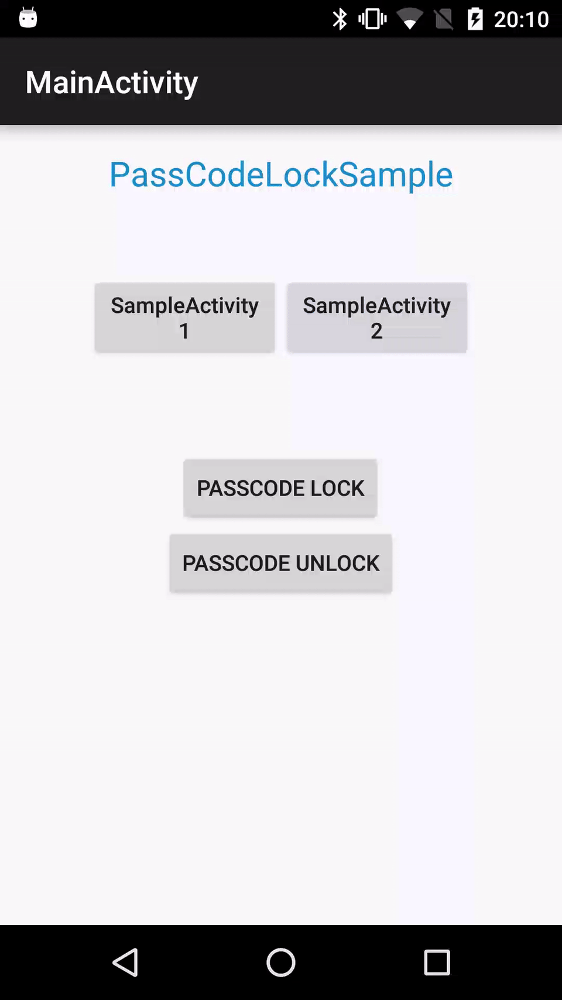

# PassCodeLockSample


## Description
This is a sample program of *passcode lock* looks like iOS.  
****
## Usage
***API 15~~***

You need implement Application.ActivityLifecycleCallbacks to your Application class and override **ComponentCallbacks2#onTrimMemory** which tell you UI hidden.

```java
public class MyApplication extends Application implements Application.ActivityLifecycleCallbacks {
    private boolean isNeedPassCodeConfirmation = true;

    @Override
    public void onCreate() {
        super.onCreate();
        registerActivityLifecycleCallbacks(this);
    }

    @Override public void onTrimMemory(int level) {
        super.onTrimMemory(level);
        if (level == ComponentCallbacks2.TRIM_MEMORY_UI_HIDDEN) {
            isNeedPassCodeConfirmation = true;
        }
    }
    
    @Override
    public void onActivityStarted(Activity activity) {
        if (isNeedPassCodeConfirmation && PrefUtil.getBoolean(PREF_KEY_IS_LOCKED)) {
            activity.startActivity(/*Activity for entering passcode*/);
        }  
        isNeedPassCodeConfirmation = false;
    }
    ~~~~
}
```
  
***Activity for entering passcode***  
```java
    @Override
    protected void onPause() {
        super.onPause();
        finish(); //remove this Activity's stack
    }

    @Override
    public boolean onKeyDown(int keyCode, KeyEvent event) {
        if (keyCode == KeyEvent.KEYCODE_BACK) {
            moveTaskToBack(true); //Application will be background without regard for Activity stack
            return true;
        }
        return super.onKeyDown(keyCode, event);
    }
```
## License

```
Copyright 2016 Takukya Endo

Licensed under the Apache License, Version 2.0 (the "License");
you may not use this file except in compliance with the License.
You may obtain a copy of the License at

   http://www.apache.org/licenses/LICENSE-2.0

Unless required by applicable law or agreed to in writing, software
distributed under the License is distributed on an "AS IS" BASIS,
WITHOUT WARRANTIES OR CONDITIONS OF ANY KIND, either express or implied.
See the License for the specific language governing permissions and
limitations under the License.
```
